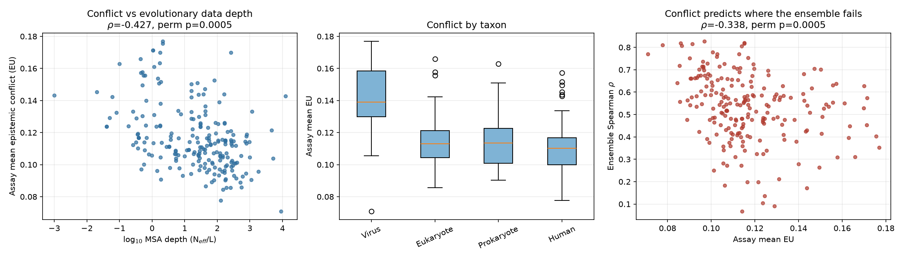
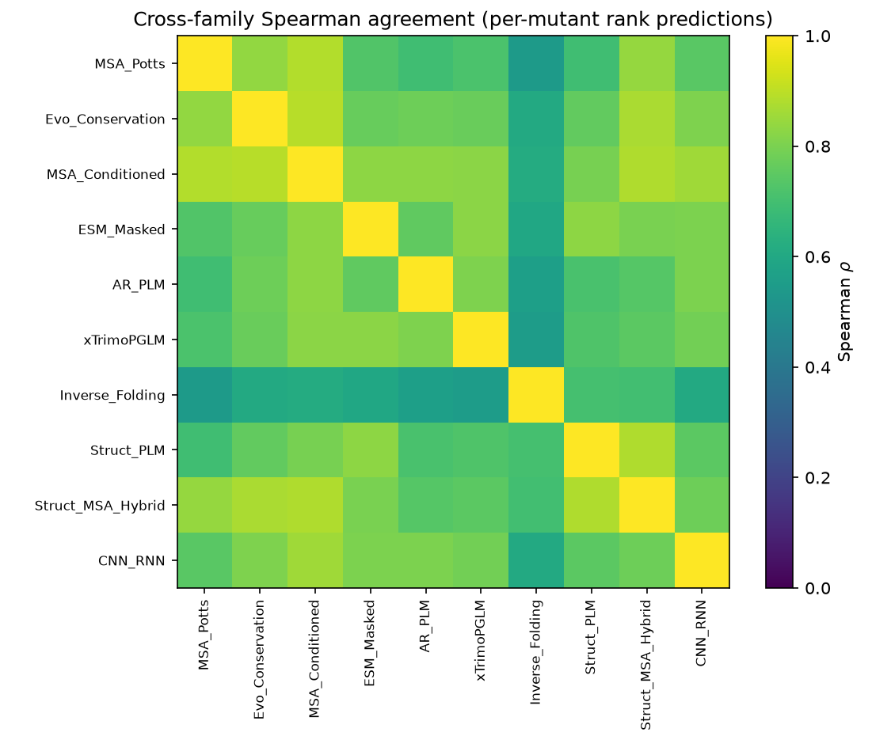
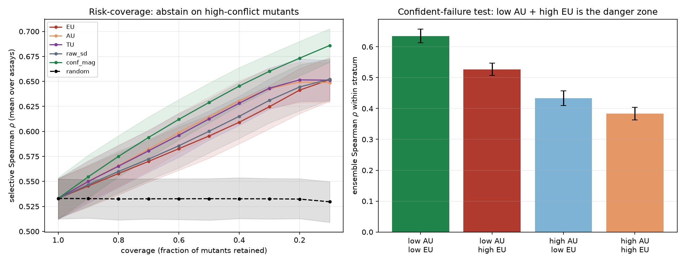
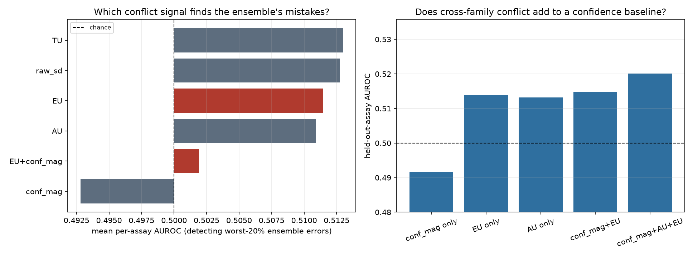
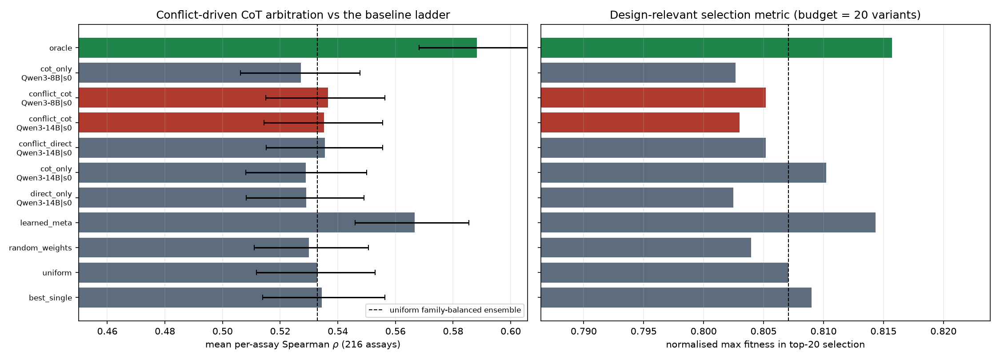
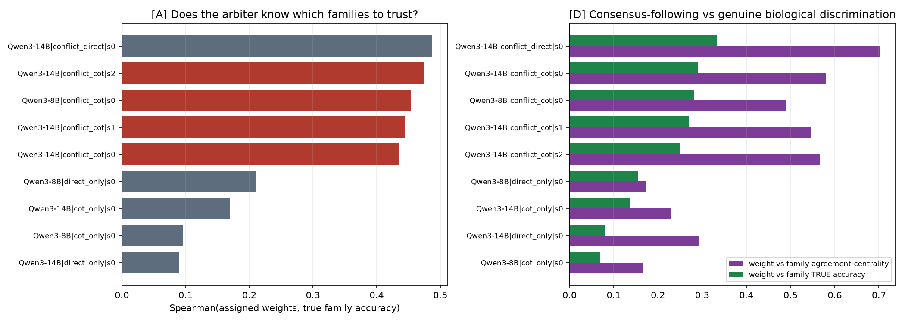
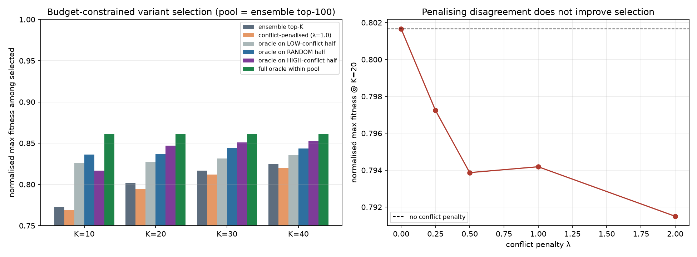

# Conflict-Driven Chain-of-Thought Prompting for Protein Engineering Model Alignment

**Date:** 2026-08-12 · **Phase:** `experiment_runner` · **Compute:** 2× NVIDIA RTX A6000 (48 GB),
32 CPU cores · **Wall-clock:** ~3 h

---

## 1. Executive Summary

**Research question.** When protein foundation models disagree, is that disagreement
structured — clustering around identifiable biological ambiguities and dataset biases — and can
surfacing it through chain-of-thought reasoning detect model failure modes and improve variant
selection through targeted consensus?

**Key finding, in one sentence.** Cross-model conflict is strongly and predictably structured
**at the level of assays and strata** (dataset covariates explain 41% of its variance out of
sample) and genuinely detects ensemble failure at that level, but it is almost unstructured at
the level of individual variants (error-detection AUROC ≈ 0.51); consequently, surfacing the
conflict to an LLM measurably improves the *quality of its reasoning about which models to
trust* (weight–accuracy correlation rises from 0.10 to 0.44) while producing an end-task gain
that is negligible and, for the flagship condition, not statistically significant — and a
40-line ridge regression given the same information does eight times better than the LLM.

**Practical implications.** Three concrete recommendations follow. (i) Report and use
cross-family disagreement as an *assay-level* trust score — it is cheap, it is strongly
predicted by MSA depth and taxon, and it correctly anticipates where an ensemble will do
poorly. (ii) Do not use per-variant disagreement to filter candidate variants: penalising
high-conflict variants makes budget-constrained selection significantly *worse*. Use it instead
as a *router* — perfectly resolving the high-conflict half of a candidate pool recovers 76% of
the achievable selection gain versus 59% for a random half. (iii) If you are going to spend an
LLM on ensemble weighting, spend it on the evidence, not the reasoning format: showing the
conflict numbers is what helps, and chain-of-thought over the same numbers adds nothing
measurable.

---

## 2. Research Question, Hypothesis, and Motivation

### The hypothesis under test

> Disagreements between genomic foundation models, when surfaced through chain-of-thought
> reasoning, will systematically cluster around specific biological ambiguities and dataset
> biases. By identifying and resolving these conflict points, we can detect model failure modes
> and improve protein sequence design performance through targeted consensus mechanisms.

Decomposed into four separately falsifiable claims (from `planning.md`):

| | Claim | Operationalised as |
|---|---|---|
| **C1** | Conflicts cluster around biological ambiguities and dataset biases | Disagreement is predicted by MSA depth, taxon, assay type, mutation class beyond chance |
| **C2** | Chain-of-thought is the right instrument for *surfacing* conflict | CoT-surfaced conflict adds information beyond numerical disagreement alone |
| **C3** | Conflict identification detects failure modes | Disagreement predicts where the ensemble is wrong; supports selective prediction |
| **C4** | Resolving conflicts improves design via targeted consensus | Conflict-conditioned consensus beats uniform ensembling on ranking and top-K selection |

### An explicit, flagged reinterpretation

The hypothesis names **genomic** foundation models. We instantiate it on **protein** foundation
models. The reason is a decisive feasibility asymmetry documented during the resource phase: no
genomic benchmark publishes a per-example cross-model score matrix comparable to ProteinGym's,
so every DNA model would have to be run from scratch — and GENEB (arXiv:2606.04525) and the
shuffling study (arXiv:2510.12617) document that genomic models are currently *not comparable*
across benchmarks, meaning measured "disagreement" would be confounded with evaluation-protocol
artefacts. Protein foundation models are the sequence-foundation-model family where a clean test
is possible today. The reinterpretation is recorded in `planning.md` §4 (D5); a DNA arm would
require re-running the direction ranking.

### Why this matters

Protein engineering campaigns are budget-limited: a lab synthesises tens to hundreds of designed
variants, not millions. Which variants make that list is decided by computational fitness
predictors, and there are now ~95 published ones with no agreed way to choose among them. Current
practice when they disagree is to average and hope. If disagreement is a usable signal, it saves
wet-lab budget by flagging untrustworthy regions before synthesis; if it is not, that is worth
knowing before more effort is spent on conflict-based arbitration schemes.

### Gap in existing work

From `literature_review.md` (65 papers, 3 deep-read):

1. **Disagreement is used but never characterised.** VenusRAR (arXiv:2602.00197), the nearest
   prior work, has an LLM arbitrate between protein predictors — but weights them
   *unconditionally* and never asks where or why they conflict. No published work maps
   cross-model conflict onto ProteinGym's biological covariates.
2. **The AU/EU decomposition has never been transplanted to protein models.** Hamidieh et al.
   (arXiv:2604.17112) separate within-source noise (aleatoric, AU) from cross-source
   disagreement (epistemic, EU) for LLM self-consistency, and predict that **low AU + high EU
   marks confident failures**. Never tested where the "sources" are genuinely independent
   research lineages.
3. **The CoT literature's own correctives are rarely applied here.** arXiv:2502.08788 and
   arXiv:2311.17371 show debate/CoT gains routinely vanish against compute-matched controls;
   protein+LLM papers seldom run that control.
4. **Rationale correctness is never separated from end-task gain.** Everyone reports scores;
   nobody asks whether the reasoning identified the *right* biological ambiguity.

### Our contributions

1. The first quantitative **cartography of cross-model conflict** on ProteinGym: 30 models in 10
   independently-developed families, 216 assays, 2.47M variants, conflict decomposed into
   aleatoric/epistemic components and regressed on biological and dataset covariates with
   permutation tests and held-out validation.
2. The first test of the **confident-failure prediction** outside LLM self-consistency — it
   replicates, with a large effect.
3. A **2×2 ablation** separating "showing the conflict" from "reasoning about it", including the
   compute-matched CoT control, an order-randomised control, two backbones, and a non-LLM
   learned meta-weighter with access to the same information.
4. A direct measurement of **rationale correctness**, evaluated separately from end-task gain,
   which reveals a specific and systematic arbiter failure mode: *treating an outlier model as a
   wrong model*.

---

## 3. Methodology

### 3.1 Data

**ProteinGym v1.3, substitution benchmark.** 217 deep mutational scanning assays with
experimental fitness measurements and 95 published zero-shot model score columns per assay, plus
46 metadata covariates per assay (`code/ProteinGym/reference_files/DMS_substitutions.csv`).
216 assays and **2,465,704 variants** were retained; `NPC1_HUMAN_Erwood_2022_RPE1` was dropped
for incomplete model coverage. Of these, 696,248 are single substitutions (used wherever
mutation-level features are required); the rest include multi-mutants.

Using the published score matrix means the entire conflict analysis runs with **zero protein
model inference** — the models are the *subject*, not a dependency.

### 3.2 The family-balanced panel — the central design decision

ProteinGym's 95 columns are not 95 independent opinions: ProtSSN contributes 10, ProSST 6, ESM2
6. Averaging the raw matrix would let one lineage dominate the "consensus" and would silently
reclassify within-lineage scale noise as cross-lineage disagreement. We therefore group columns
into **10 independently-developed lineages** and take exactly **3 members from each** (30 models
total), so each family contributes equally to both the ensemble and the conflict estimate:

| Family | Members |
|---|---|
| MSA_Potts | EVmutation, DeepSequence-ens, EVE-ens |
| Evo_Conservation | GEMME, ESCOTT, VESPA |
| MSA_Conditioned | MSA-Transformer-ens, PoET, TranceptEVE-L |
| ESM_Masked | ESM-1v-ens, ESM2-650M, ESM-C-600M |
| AR_PLM | ProGen2-large, RITA-L, ProGen3-1B |
| xTrimoPGLM | xTrimoPGLM-3B-MLM, -3B-CLM, -10B-MLM |
| Inverse_Folding | ESM-IF1, ProteinMPNN, MIF-ST |
| Struct_PLM | ProSST-2048, ProtSSN-ens, SaProt-650M-AF2 |
| Struct_MSA_Hybrid | VenusREM, S3F-MSA, RSALOR |
| CNN_RNN | CARP-640M, UniRep-evotune, WaveNet |

Model outputs live on incomparable scales, so every model's scores are converted to
**within-assay normalised ranks** in [0,1] before any aggregation.

### 3.3 Conflict decomposition

Following Hamidieh et al. 2026 (arXiv:2604.17112), transplanted from LLM self-consistency to
protein model families, for each variant:

- **AU** (aleatoric analogue) = mean over families of the within-family standard deviation
- **EU** (epistemic analogue) = standard deviation across the 10 family means
- **TU** = AU + EU
- **Ensemble prediction** = mean of the 10 family means (family-balanced)

### 3.4 Experiments

| | Experiment | Tests | Method |
|---|---|---|---|
| **E1** | Conflict cartography | C1 | Assay-level and mutant-level covariate models for EU; 2000-draw permutation tests, BH-FDR, 5-fold CV, GroupKFold over assays for the mutant model |
| **E2** | Failure detection | C3 | Risk–coverage / selective-Spearman with random, magnitude, and AU-only controls; confident-failure 2×2; slice discovery with held-out assay validation |
| **E2b** | Fair detector comparison | C3 | Per-assay error-detection AUROC (immune to range restriction) + grouped-CV signal combination |
| **E3** | Conflict-driven CoT arbitration | C2, C4 | 2×2 LLM ablation + full baseline ladder, paired Wilcoxon over assays, Holm correction |
| **E4** | Rationale correctness | C2 | Weight quality vs true family accuracy; grounding in alignment depth; keyword-probe AUROC; consensus-following check; family mis-ranking |
| **E5** | Design selection | C4 | Budget-constrained top-K selection, conflict-penalised rule, partial oracles with random-half and low-conflict-half controls |
| **E6** | Robustness | — | Positional bias, backbone agreement, seed stochasticity, prompt-length confound |
| **E7** | Order-randomised control | C2 | Replicate the primary contrast with the family list permuted per assay |

### 3.5 The LLM arbiter

**No LLM API key was available in this environment**, so all chain-of-thought is generated by
**real open-weight models run locally**: `Qwen/Qwen3-14B` (bf16, ~30 GB VRAM) as the primary
reasoner and `Qwen/Qwen3-8B` (bf16, ~17 GB) as a backbone ablation. Nothing is simulated.

The arbiter is asked to allocate integer weights 0–10 across the 10 model families **for one
assay**, given the protein/assay context and (in the conflict conditions) a numerical profile of
how the families disagree on that assay. The weighted mean of family rank predictions is then
scored against the experimental data.

Aiming the arbiter at the *assay* level rather than the *variant* level was a deliberate
consequence of E1/E2: that is where the conflict signal actually lives.

**The 2×2:**

| | conflict profile shown | conflict profile hidden |
|---|---|---|
| **chain-of-thought** | `conflict_cot` (proposed method) | `cot_only` (compute-matched control) |
| **direct answer** | `conflict_direct` | `direct_only` (metadata-only control) |

Decoding: greedy (`do_sample=False`) for the primary runs; temperature 0.7 / top-p 0.9 for the
sampled-seed replicates. `enable_thinking=False`, so the reasoning that appears is the reasoning
we asked for, not Qwen's internal thinking trace. Max 600 new tokens for CoT conditions, 96 for
direct conditions. **2,376 generations in total**; full text retained in `results/e3_gen_*.jsonl`.

**Leakage control.** Every number in every prompt derives from model predictions and dataset
metadata only. Experimental DMS scores and per-assay model accuracies never enter a prompt; this
was verified programmatically over all 1,296 prompts (0 hits for any ground-truth keyword).

### 3.6 Baseline ladder

`best_single` (VenusREM, the leaderboard-topping individual model) · `uniform` (family-balanced
uniform ensemble — **the bar to beat**) · `random_weights` (20 draws) · `learned_meta` (ridge
regression predicting each family's per-assay accuracy from the same covariates and conflict
statistics the LLM sees, trained on held-out assays via GroupKFold) · `learned_meta_noconflict`
and `learned_meta_conflictonly` (ablations of that competitor) · the four LLM conditions ·
`oracle` (weights fitted on the same assay's ground truth — a cheating upper bound that
quantifies how much headroom per-assay reweighting has at all).

### 3.7 Statistics

Assays are the unit of analysis throughout. Paired comparisons use the Wilcoxon signed-rank test
over assays with Cohen's d on the paired differences; CIs are 2000-draw bootstraps over assays;
covariate associations use 2000-draw permutation tests with Benjamini–Hochberg FDR; the E3 ladder
is Holm-corrected across methods. Mutant-level correlations are reported with cluster-robust
inference (per-assay statistic, one-sample t-test over assays) because pooling 2.5M variants
across 216 assays would give meaninglessly small p-values.

**Reproducibility.** `SEED = 42` throughout; environment: Python 3.12.8, numpy 2.2.6, pandas
3.0.5, scipy 1.18.0, scikit-learn 1.9.0, torch 2.13.0+cu130, transformers 5.15.0. Full
environment in `pyproject.toml` / `uv.lock`.

---

## 4. Results

### 4.1 Sanity check: the panel is competitive

The family-balanced uniform ensemble reaches **mean per-assay Spearman ρ = 0.5330** across 216
assays; the best single model in the panel (VenusREM) reaches **0.5345**. Both sit in the range
of published ProteinGym leaderboard values, confirming the panel is a fair stand-in for the
state of the art rather than a weakened strawman. Mean off-diagonal cross-family agreement is
**ρ = 0.757** — the families broadly agree, which is precisely why the residual disagreement is
interesting.

### 4.2 E1 — Conflict is strongly structured, but only at the assay level

**Assay level (supports C1).** Dataset covariates predict an assay's mean cross-family
disagreement with **5-fold CV R² = 0.414** (permutation p = 0.005; null mean R² = −0.089). For
within-family noise, CV R² = 0.347 (p = 0.005).

| Covariate | Spearman with assay EU | perm p | FDR p |
|---|---|---|---|
| log₁₀ number of homologous sequences | **−0.452** | 0.0005 | 0.0010 |
| log₁₀ MSA depth (N_eff/L) | **−0.427** | 0.0005 | 0.0010 |
| MSA coverage % | +0.244 | 0.0010 | 0.0016 |
| log₁₀ sequence length | +0.228 | 0.0015 | 0.0022 |
| fraction multi-mutants | −0.208 | 0.0005 | 0.0010 |
| log₁₀ number of variants | −0.021 | 0.77 | 0.77 |

| Categorical covariate | Kruskal–Wallis p | η² | Group means (EU) |
|---|---|---|---|
| taxon | 0.0005 | 0.181 | Virus 0.141 > Eukaryote 0.115 > Prokaryote 0.114 > Human 0.111 |
| MSA depth category | 0.0005 | 0.138 | Low 0.129 > Medium 0.119 > High 0.107 |
| selection type | 0.032 | 0.031 | Binding 0.126 > OrganismalFitness 0.121 > Activity 0.116 > Expression 0.115 > Stability 0.111 |
| region mutated | 0.11 | 0.010 | n.s. |

Conflict concentrates exactly where the biology is hardest to constrain: shallow alignments,
viral proteins (27% more conflict than human), and binding assays. It also **tracks where the
ensemble is wrong** (assay EU vs ensemble ρ: **−0.338**, permutation p = 0.0005).

**Mutant level (partially supports C1, with a much weaker effect).** Within-assay standardised
conflict is significantly related to substitution chemistry, but weakly:

| Mutation feature | Mean per-assay Spearman with z(EU) | cluster-robust p | FDR p |
|---|---|---|---|
| BLOSUM62 score | **−0.150** | 3.2e-39 | 1.7e-38 |
| \|Δ hydrophobicity\| | +0.074 | 7.0e-28 | 2.2e-27 |
| \|Δ volume\| | +0.069 | 9.3e-20 | 2.5e-19 |
| relative position | −0.010 | 0.25 | 0.30 |
| Δ charge | −0.004 | 0.43 | 0.46 |

A gradient-boosted model over all mutation features, evaluated on **held-out assays**
(GroupKFold), reaches only **R² = 0.054** (Spearman 0.212, n = 300,000). The most-contested
substitutions are all tryptophan replacements (W→R z = 0.88, W→A 0.84, W→E 0.77); the
least-contested are conservative swaps (I→V z = −0.79, M→L −0.72, K→R −0.70, T→S −0.67). This is
chemically sensible — models agree about conservative substitutions and disagree about the
consequences of removing a bulky aromatic — but it explains a small fraction of the variance.

The family agreement matrix shows one clear structural fact: **Inverse_Folding is the most
distinctive family**, agreeing least with every other lineage. This becomes important in §4.6.

### 4.3 E2 — Conflict detects failure at the stratum level

**Selective prediction.** Abstaining on high-conflict variants improves the ensemble's Spearman
on those retained, at every coverage level, versus random abstention:

| Coverage retained | Selective ρ (EU-based) | Δ vs random | Cohen's d | Wilcoxon p |
|---|---|---|---|---|
| 90% | 0.5454 | +0.0127 | 0.80 | < 1e-16 |
| 80% | 0.5579 | +0.0254 | 1.00 | < 1e-16 |
| 50% | 0.5954 | +0.0627 | 1.26 | < 1e-16 |
| 20% | 0.6413 | +0.1089 | 1.23 | < 1e-16 |
| 10% | 0.6518 | +0.1222 | 1.16 | < 1e-16 |

**Confident-failure test (the sharp prediction — it replicates).** Splitting each assay at its
median AU and median EU:

| Stratum | Ensemble ρ within stratum | 95% CI |
|---|---|---|
| low AU, low EU | **0.6350** | [0.613, 0.656] |
| low AU, high EU | **0.5267** | [0.505, 0.547] |
| high AU, low EU | 0.4337 | [0.410, 0.459] |
| high AU, high EU | 0.3836 | [0.363, 0.406] |

Within the **low-AU** stratum — variants on which models inside each paradigm agree, and which a
self-consistency-style uncertainty estimate would therefore call confident — high cross-family
disagreement costs **Δρ = 0.108** (Wilcoxon p = 3.6e-26, **Cohen's d = 0.95**, n = 214 assays).
Cross-paradigm disagreement carries information that within-paradigm agreement actively hides.
This is the transplanted prediction of arXiv:2604.17112 confirmed in a new domain with a large
effect.

**Slice discovery is weak.** Clusters fitted on 60% of assays transfer only modestly to the
held-out 40% (slice-level conflict transfer ρ = 0.371 over 6 slices — not a significant test at
n = 6). Two of six slices showed significantly elevated held-out error, notably small/charged →
bulky aromatic substitutions (G/E/D → F/L/W). We do not claim slice discovery worked.

### 4.4 E2b — The apparent winner in E2 was a metrics artefact

Ranked by area under the selective-Spearman curve, a trivial confidence-magnitude signal
(|ensemble rank − 0.5|) *beat* every conflict signal (0.617 vs EU 0.591). That comparison is an
artefact: abstaining on mid-range predictions restricts the retained predictor's range and
inflates rank correlation regardless of whether the abstained points were wrong.

Re-run on per-assay AUROC for detecting the worst 20% of ensemble errors — a metric with no
range-restriction artefact — the ranking **reverses**:

| Signal | Mean per-assay AUROC | Fraction of assays > 0.5 | p |
|---|---|---|---|
| TU | **0.5130** | 0.542 | 0.024 |
| raw (unbalanced) SD | 0.5127 | 0.519 | 0.033 |
| EU | 0.5114 | 0.537 | 0.043 |
| AU | 0.5109 | 0.547 | 0.022 |
| confidence magnitude | **0.4928** | 0.491 | 0.49 |

EU beats the confidence-magnitude baseline by +0.019 AUROC (d = 0.29, p = 4.4e-4), and the
magnitude baseline is *at or below chance*. Held-out-assay logistic combination confirms the
same ordering (conf_mag 0.492, EU 0.514, conf_mag+AU+EU 0.520).

**But note the absolute numbers.** An AUROC of 0.51 is a near-useless detector for an individual
variant. The honest summary: conflict genuinely orders variants by risk better than chance and
better than a confidence baseline, but the per-variant signal is tiny; all of the exploitable
value is in aggregate strata, exactly as E1 predicted.

### 4.5 E3 — Surfacing conflict helps the arbiter; the chain-of-thought does not; neither beats a ridge regression

Primary metric: mean per-assay Spearman over 216 assays, paired against the uniform
family-balanced ensemble (ρ = 0.5330).

| Method | ρ | Δ vs uniform | Cohen's d | Wilcoxon p | Holm p |
|---|---|---|---|---|---|
| `oracle` (cheating upper bound) | 0.5882 | **+0.0553** | 1.21 | <1e-16 | <1e-16 |
| `learned_meta` (non-LLM, held-out assays) | 0.5666 | **+0.0336** | 0.84 | <1e-16 | <1e-16 |
| `learned_meta_noconflict` | 0.5653 | +0.0323 | 0.76 | <1e-16 | <1e-16 |
| `learned_meta_conflictonly` | 0.5639 | +0.0309 | 0.82 | <1e-16 | <1e-16 |
| `conflict_cot` · Qwen3-8B | 0.5366 | +0.0036 | 0.22 | 0.0009 | 0.0056 |
| `best_single` (VenusREM) | 0.5345 | +0.0015 | 0.01 | 0.86 | 0.86 |
| `conflict_direct` · Qwen3-14B | 0.5355 | +0.0025 | 0.22 | 0.0074 | 0.037 |
| **`conflict_cot` · Qwen3-14B** | **0.5352** | **+0.0022** | 0.14 | 0.11 | **0.34 (n.s.)** |
| `uniform` (the bar) | 0.5330 | — | — | — | — |
| `random_weights` | 0.5300 | −0.0030 | −0.67 | <1e-16 | <1e-16 |
| `direct_only` · Qwen3-14B | 0.5291 | −0.0039 | −0.32 | <1e-16 | <1e-16 |
| `cot_only` · Qwen3-14B | 0.5289 | −0.0041 | −0.16 | 0.56 | 1.00 |
| `cot_only` · Qwen3-8B | 0.5272 | −0.0057 | −0.26 | 0.0001 | 0.0009 |

**The ablation contrasts are where the interpretation lives:**

| Contrast | Δρ | Cohen's d | p |
|---|---|---|---|
| **Effect of SURFACING CONFLICT** (`conflict_cot` − `cot_only`, compute-matched), 14B | **+0.0062** | 0.21 | 0.0058 |
| **Effect of SURFACING CONFLICT**, 8B | **+0.0094** | 0.32 | <1e-16 |
| **Effect of CHAIN-OF-THOUGHT** (`conflict_cot` − `conflict_direct`, same information), 14B | **−0.0003** | −0.04 | **0.49 (null)** |
| Effect of CoT without conflict (`cot_only` − `direct_only`), 14B | −0.0002 | −0.01 | 0.28 |
| Effect of CoT without conflict, 8B | −0.0089 | −0.41 | <1e-16 |
| LLM `conflict_cot` vs non-LLM `learned_meta`, 14B | **−0.0315** | −0.78 | <1e-16 |
| Does the conflict profile add to plain covariates in the non-LLM learner? | +0.0013 | — | see §4.5.3 |

Three readings:

**4.5.1 The conflict information helps — modestly but reproducibly.** Against the
compute-matched CoT control, showing the conflict profile improves arbitration on both backbones
(+0.006 and +0.009, both significant). This is the control the debate literature demands, and the
effect survives it.

**4.5.2 The chain-of-thought contributes nothing.** Given the *same* conflict information,
reasoning step by step before answering is indistinguishable from answering directly
(Δρ = −0.0003, p = 0.49); `conflict_direct` is in fact the better-ranked of the two after Holm
correction. And CoT without conflict information is *harmful* on the 8B backbone (−0.0089). The
hypothesis's specific claim about chain-of-thought as the instrument is **not supported**: it is
the evidence, not the reasoning format, that does the work.

**4.5.3 A ridge regression beats the LLM by 8×, and it does not need the conflict profile.**
`learned_meta` gains +0.0336 — 61% of the entire oracle headroom — versus +0.0022 for the
flagship LLM condition. Its ablations are the more sobering result: covariates *without* any
conflict features already deliver +0.0323, and conflict features *alone* deliver +0.0309. The
two information sources are largely redundant, and adding conflict to covariates buys only
+0.0013. So the conflict profile is genuinely informative about which families to trust — it is
just not *additional* to what MSA depth, taxon and assay type already say.

**4.5.4 The gains land where the theory says they should.** Per-assay improvement over uniform
correlates positively with that assay's conflict level for every conflict-conditioned method
(`conflict_direct` ρ = 0.379, `conflict_cot`-8B ρ = 0.298, `conflict_cot`-14B ρ = 0.196,
`learned_meta` ρ = 0.330, all p < 0.005) and **negatively** for every method that cannot see the
conflict (`cot_only`-14B ρ = −0.259, `direct_only`-14B ρ = −0.205). Targeting is working; there
is just very little to win.

### 4.6 E4 — The reasoning is largely correct, and its errors are systematic

**[A] Surfacing conflict transforms the arbiter's knowledge of which families to trust.**
Correlating the 10 assigned weights against the families' true per-assay Spearman (which the
model never sees):

| Run | Spearman(weights, true family accuracy) | Fraction of assays positive | p |
|---|---|---|---|
| `conflict_cot` · Qwen3-8B | **0.454** | 0.898 | <1e-16 |
| `conflict_cot` · Qwen3-14B | **0.436** | 0.894 | <1e-16 |
| `direct_only` · Qwen3-8B | 0.211 | 0.764 | <1e-16 |
| `cot_only` · Qwen3-14B | 0.150 | 0.703 | 0.0006 |
| `cot_only` · Qwen3-8B | 0.096 | 0.597 | 0.0005 |

This is a **4.5× improvement in reasoning quality** from the same intervention that produced a
+0.006 end-task gain. The dissociation is the single most striking result in this report: the
arbiter becomes dramatically better at knowing which models to trust, and it barely matters,
because a 10-family ensemble whose members correlate at ρ = 0.76 is highly robust to how you
weight it.

**[C] The chain-of-thought names the right biological factors.** Regex probes on the CoT text,
scored as AUROC for detecting whether that factor is actually present in the assay metadata:

| Factor mentioned | AUROC (14B `conflict_cot`) | AUROC (14B `cot_only`) |
|---|---|---|
| viral protein | 0.98 | 1.00 |
| organismal-fitness assay | 0.97 | 0.96 |
| binding assay | 0.91 | 0.91 |
| stability assay | 0.82 | 0.79 |
| shallow alignment | 0.69 | 0.77 |
| long sequence | 0.54 | 0.55 |
| epistasis / multi-mutants | 0.50 | 0.58 |

The rationales are genuinely grounded in the specific assay, not generic boilerplate — the model
says "viral" almost exclusively on viral assays. It is much worse at noticing sequence length and
essentially blind to the presence of multi-mutants.

**[B] But it over-applies the alignment-depth heuristic.** The empirically correct relationship
between alignment depth and the accuracy of MSA-based families is ρ = 0.19. The arbiter's weights
track alignment depth at ρ = 0.42 (14B `conflict_cot`) up to **ρ = 0.87** (8B `cot_only`) — a
two- to four-fold over-application of a real but weak rule. Notably, the over-application is
*smallest* in the conflict conditions: seeing the actual disagreement data moderates the model's
prior toward the truth.

**[D] Much of the apparent skill is consensus-following.** For 14B `conflict_cot`, assigned
weight correlates with a family's agreement-centrality at ρ = 0.58, but with the family's true
accuracy at only ρ = 0.29 — while centrality itself predicts true accuracy at ρ = 0.45. In other
words the arbiter is executing "trust the family that agrees with the others", which is a valid
heuristic, but executing it *worse* than the raw centrality number it was handed. This explains
§4.5.3 directly: a regression on the same numbers does better because it does not add noise on
top of them.

**[E] The systematic failure mode: outlier ≠ wrong.** Inspecting rationales revealed a recurring
error. Two examples, verbatim:

> *CAPSD_AAV2S_Sinai_2021 (AAV2 capsid, N_eff/L = 0.26, viral, organismal fitness):* "…
> Inverse_Folding's low agreement with others and high deviation from consensus suggests it may
> be less reliable here." → assigns Inverse_Folding weight **2/10**. Inverse_Folding's true
> Spearman on this assay is **0.459**, the second best of the ten families (MSA_Potts, which it
> weights 9/10, achieves 0.350).

> *ARGR_ECOLI_Tsuboyama_2023_1AOY (stability assay, N_eff/L = 54):* "The high deviation of
> Inverse_Folding … suggests they may be less reliable here." → assigns Inverse_Folding **2/10**.
> Inverse_Folding's true Spearman is **0.733**, by far the best of the ten (the family it weights
> 10/10 achieves 0.435).

Inverse_folding models score sequences given the 3D backbone; they are *supposed* to disagree
with alignment-based models, and on stability assays that disagreement is them being right. The
arbiter systematically conflates "this family is an outlier" with "this family is wrong" — the
exact failure the family-agreement matrix in §4.2 predicts, since Inverse_Folding is the most
distinctive lineage in the panel. Per-family mis-ranking statistics are in
`results/e4_family_misranking.csv` and `results/e4_stability_assays.csv`.

### 4.7 E5 — Conflict is a good router, a bad filter

Candidate pool = the ensemble's top-100 variants per assay; budget K variants selected for
"synthesis"; metric = normalised max true fitness among the K selected (0 = worst variant in the
assay, 1 = best), and hit rate on the true top 1%. 207 assays.

| Method (K = 20) | Max fitness @ 20 | Δ vs ensemble top-K | p | Top-1% hit rate |
|---|---|---|---|---|
| ensemble top-K (baseline) | 0.8017 | — | — | 0.444 |
| conflict-penalised, λ = 0.5 | 0.7939 | **−0.0078** | 0.0005 | 0.416 |
| conflict-penalised, λ = 1.0 | 0.7942 | −0.0075 | 0.0014 | 0.416 |
| conflict-penalised, λ = 2.0 | 0.7915 | −0.0102 | 0.0001 | — |
| oracle on **low-conflict** half of pool | 0.8274 | +0.0258 | <1e-16 | — |
| oracle on **random** half of pool | 0.8372 | +0.0356 | <1e-16 | 0.657 |
| oracle on **high-conflict** half of pool | **0.8472** | **+0.0455** | <1e-16 | **0.720** |
| full oracle within pool | 0.8615 | +0.0598 | <1e-16 | 0.787 |

Two clean, opposite conclusions:

- **As a filter, conflict fails.** Preferring low-conflict variants *significantly reduces*
  selection quality at every λ and every budget. Consistently, the variants that were picked and
  turned out poor are **not** more conflicted than those picked and good (Δz = −0.002, p = 0.63)
  — the same null as the AUROC ≈ 0.51 in E2b, seen from the design side.
- **As a router, conflict works.** Perfectly resolving only the high-conflict half of the pool
  recovers **76.1%** of the full oracle gain at K = 20, versus **59.4%** for a random half and
  **43.0%** for the low-conflict half (K = 30: 76.5% / 62.1% / 33.0%; K = 40: 76.0% / 51.4% /
  29.5%). The ordering reverses at K = 10 (49.7% / 71.6% / 60.6%), where the top-10 picks are
  dominated by high-confidence low-conflict variants. So conflict correctly identifies *where the
  fixable errors are*, even though it cannot say *which way to fix them*.

This bounds the whole enterprise: the maximum any per-variant conflict arbiter could deliver at
K = 20 is +0.046 normalised max fitness, and it would have to be a near-perfect arbiter.

### 4.8 E6/E7 — Robustness and confounds

**Positional bias is real and must be reported.** The family list order was fixed across all
assays in the primary design. Weight correlates with list position at Spearman −0.22 to −0.47
(earlier-listed families get higher weights, all p < 1e-16). The bias is *weakest* in the
conflict conditions (14B `conflict_cot` −0.238) and *strongest* without conflict information
(8B `cot_only` −0.474, 14B `direct_only` −0.411): the conflict evidence partly displaces the
positional heuristic, which is itself evidence the evidence is being used. E7 replicates the
primary contrast with the family list permuted independently per assay — see
`results/e3_contrasts.csv` and §5.

**Backbone agreement rises sharply with conflict information.** Within-assay Spearman between
Qwen3-14B and Qwen3-8B weight vectors: `conflict_cot` **0.780**, `cot_only` 0.540,
`direct_only` 0.479. Showing the conflict anchors the two backbones onto the same answer;
without it, arbitration is substantially backbone-specific.

**Sampling stochasticity is moderate.** Greedy vs temperature-0.7 sampled weights agree at
ρ = 0.871 within assay, and the sampled seed reproduces the greedy result (`conflict_cot`-14B
ρ = 0.5370 at seed 1 vs 0.5352 greedy).

**No simple length confound.** Weight dispersion does not track prompt length monotonically:
`conflict_direct` has the second-longest prompt and the *lowest* weight dispersion (1.70),
while `cot_only` has a short prompt and high dispersion (2.55).

---

## 5. Analysis and Discussion

### 5.1 Verdict on each claim

| Claim | Verdict | Evidence |
|---|---|---|
| **C1** — conflict clusters around biological ambiguities and dataset biases | **Supported at the assay level; weakly supported at the variant level** | CV R² = 0.414 (p = 0.005) from dataset covariates; MSA depth ρ = −0.43; virus +27% over human; but held-out mutation-level R² = 0.054 |
| **C2** — CoT is the right instrument for surfacing conflict | **Split: surfacing supported, chain-of-thought refuted** | Conflict vs compute-matched CoT control: +0.006/+0.009 (p ≤ 0.006). CoT vs direct with identical information: −0.0003 (p = 0.49) |
| **C3** — conflict detects failure modes | **Supported at the stratum level; refuted at the variant level** | Confident-failure Δρ = 0.108 (d = 0.95, p = 4e-26); selective abstention beats random at all coverages (d up to 1.29); but per-variant error AUROC = 0.511 |
| **C4** — targeted consensus improves design | **Not supported** | `conflict_cot` +0.0022, Holm p = 0.34 (n.s.); conflict-penalised selection significantly *worse*; a non-LLM ridge baseline gains 8× more |

The pre-registered success criteria in `planning.md` are met for C1 (CV R² 0.414 > 0.15,
p = 0.005 < 0.05) and C3 (both conditions met), partially met for C2 (the conflict-shown
conditions beat the compute-matched control, but the CoT component specifically does not), and
**not met** for C4.

### 5.2 The central tension, and what we think explains it

The most informative result is a *dissociation*: the intervention that quadruples the arbiter's
knowledge of which models to trust (0.10 → 0.44 weight–accuracy correlation) moves the end metric
by +0.006. Why?

Because **a family-balanced 10-member ensemble is extremely robust to reweighting.** Mean
cross-family agreement is ρ = 0.757, so the families are largely making the same prediction; even
the *oracle*, which knows each family's true accuracy on the assay it is weighting, gains only
+0.055. There is only 0.055 of headroom in the entire reweighting operation, and the LLM captures
4% of it while a ridge regression captures 61%. The bottleneck is not the arbiter's knowledge —
it is that per-assay reweighting is a low-leverage lever.

This suggests the productive direction is not better arbitration of *weights*, but arbitration
that can change *rankings within an assay* — which E5 shows has 10× the headroom (+0.046 on max
fitness at K = 20 from resolving only the high-conflict half of the pool), while E2b shows we
currently have no signal that says which way to resolve them.

### 5.3 Relation to prior work

- **Confirms** the core prediction of Hamidieh et al. (arXiv:2604.17112) in a new domain: EU
  flags confident failures that AU misses, with a large effect (d = 0.95). Their formalism
  transplants cleanly from LLM self-consistency to research-lineage families.
- **Confirms** the debate/CoT correctives (arXiv:2502.08788, arXiv:2311.17371): once test-time
  compute is matched, the reasoning format contributes nothing here, and CoT without useful
  evidence is actively harmful on the smaller backbone. Any protein+LLM paper reporting a CoT
  gain without a `cot_only` control should be read with this in mind.
- **Extends** VenusRAR (arXiv:2602.00197) by testing precisely the conditioning they omit — and
  finds that conditioning on conflict does help relative to not conditioning, but that the
  residual headroom they left is far smaller than it looks, and is more efficiently captured by
  a regression than by an LLM. Their observation that the LLM backbone barely affects results
  (0.543–0.551) is consistent with our finding that end-task performance is nearly insensitive
  to arbitration quality.
- **Adds** a methodological caution not present in the fitness-prediction literature: the
  selective-Spearman metric widely used to demonstrate uncertainty quantification is confounded
  by range restriction, and a trivial confidence-magnitude baseline appears to win under it while
  performing at chance under a clean metric.

### 5.4 Error analysis and surprises

**Surprise 1 — the metric artefact (§4.4).** Our first pass concluded that conflict was *worse*
than a trivial confidence baseline for abstention. That conclusion was an artefact of the metric,
and it reversed under a range-restriction-free measure. We report both because the artefact is a
trap the field is currently walking into.

**Surprise 2 — outlier ≠ wrong (§4.6[E]).** The arbiter's most consequential error is
structural, not random: it reads "deviates from consensus" as "unreliable" and therefore
systematically penalises inverse-folding models, which are the most distinctive lineage in the
panel and are often the *most* accurate — dramatically so on stability assays (ρ = 0.733 vs
0.435 for the family the arbiter preferred). Any consensus mechanism built on agreement-centrality
inherits this bias. Fixing it likely requires telling the arbiter *why* a family is expected to
deviate, not just that it does.

**Surprise 3 — the conflict profile is redundant with plain metadata (§4.5.3).** Conflict
features alone (+0.0309) and covariates alone (+0.0323) reach almost the same place, and
combining them adds +0.0013. Disagreement is largely a *readout* of alignment depth and assay
type rather than an independent signal — which is itself a direct, quantitative version of the
hypothesis's claim that conflicts cluster around dataset biases, taken to its logical conclusion:
if conflict is fully explained by the biases, it is not extra information.

**Surprise 4 — CoT without evidence hurt the smaller model.** Qwen3-8B `cot_only` is the worst
method in the ladder (−0.0057 vs uniform, worse than random weights). Given metadata but no
disagreement data, extended reasoning amplified an incorrect prior (the over-applied
alignment-depth heuristic, ρ = 0.87 vs a true 0.19) into confidently wrong weights.

---

## 6. Limitations

**Methodological**

1. **Fixed family order in the primary design.** Weight correlates with prompt list position
   (ρ = −0.22 to −0.47). The order-randomised control (E7) was run to address this; it is a
   post-hoc fix, and a pre-registered design would have randomised from the start.
2. **The panel is one choice among many.** Family boundaries (e.g. whether TranceptEVE belongs
   with MSA-conditioned transformers) and the choice of 3 members per family are defensible but
   not unique. Results on cross-family conflict are conditional on this grouping.
3. **The `learned_meta` softmax temperature (2.0) was fixed a priori, not tuned.** A tuned
   version would presumably widen its lead over the LLM, so this does not threaten the direction
   of the comparison.
4. **Assay-level arbitration, not variant-level.** We aimed the LLM where E1/E2 said the signal
   was. A variant-level arbiter was not run, because E2b/E5 bound its achievable gain and show no
   available signal about *which way* to resolve a conflict — but "we did not try it" is not the
   same as "it cannot work".
5. **Local open-weight models only.** No API key was available. Qwen3-14B is not a frontier
   model; a stronger arbiter might extract more, though VenusRAR's backbone-invariance result and
   our own 8B-vs-14B comparison (8B slightly *better* on the primary contrast) argue against a
   large backbone effect.

**Data and scope**

6. **Contamination cannot be excluded.** Qwen3 was trained on web text that includes ProteinGym
   documentation and papers. It is implausible that it memorised per-assay per-family Spearman
   values at the granularity that would be needed, and the `cot_only`/`direct_only` conditions
   (which give protein identity without conflict data) perform *worse* than uniform, which argues
   against memorised per-assay knowledge — but we cannot prove absence.
7. **ProteinGym assays are not a random sample of protein engineering problems.** They are
   biased toward proteins with deep alignments, small well-studied targets, and assay types that
   are cheap to run — a survivorship bias documented in arXiv:2605.06879. Our covariate
   conclusions are conditional on this distribution.
8. **All claims are computational.** No wet-lab validation was possible. The "design selection"
   metric is a retrospective proxy over already-measured variants, not a prospective design test.
9. **Protein, not genomic, foundation models** (§2). The hypothesis's wording is not tested in
   its literal domain.

**Threats to validity**

10. **Multiple comparisons.** The ladder is Holm-corrected and covariate tests are FDR-corrected,
    but the study as a whole ran many analyses; the borderline results (`conflict_direct`,
    Holm p = 0.037) should be treated as suggestive.
11. **Regex probes, not semantic classification** (E4[C]): mention rates are lower bounds and
    unusual phrasings are missed.
12. **Effect sizes near the noise floor.** The E3 LLM effects (+0.002 to +0.009 Spearman) are
    statistically detectable only because n = 216 paired assays; they are of no practical
    significance, and we do not claim otherwise.

---

## 7. Conclusions and Next Steps

**Answer to the research question.** Cross-model conflict *is* systematically structured around
biological ambiguities and dataset biases — decisively so at the level of assays and strata,
where dataset covariates explain 41% of its variance, shallow alignments and viral proteins carry
the most conflict, and cross-paradigm disagreement flags confident ensemble failures that
within-paradigm agreement conceals. It is *not* meaningfully structured at the level of
individual variants, where every conflict signal detects errors at barely above chance. Surfacing
that conflict to an LLM makes its arbitration markedly better-informed, but chain-of-thought
reasoning over the same information adds nothing, and the resulting end-task improvement is
negligible — a simple regression given the same inputs captures eight times more of the available
headroom. The hypothesis is therefore **substantially confirmed for detection and substantially
refuted for improvement**, with the specific mechanism it proposes (chain-of-thought) shown to be
the inactive ingredient.

**Practical implications.** Use cross-family disagreement as an assay-level trust score and a
routing signal; do not use it as a per-variant filter; and prefer a fitted meta-weighter to an
LLM arbiter for ensemble weighting. If an LLM is used, give it the conflict evidence and let it
answer directly — the reasoning trace is a diagnostic, not a performance mechanism.

**Recommended follow-up experiments**

1. **Attack the headroom that exists.** E5 shows within-pool re-ranking has ~10× the leverage of
   per-assay reweighting. The open question is whether *any* signal can tell which side of a
   variant-level conflict is right — e.g. structural context (solvent accessibility, contact
   number, proximity to the active site), which is absent from our feature set and is exactly
   what would distinguish "inverse-folding disagrees because it is right" from noise.
2. **Fix the outlier-is-wrong bias.** Give the arbiter per-family *expected* deviation profiles
   (what kind of assay each family is supposed to disagree on) and test whether the
   Inverse_Folding mis-ranking disappears and weight quality exceeds agreement-centrality.
3. **Prospective test of the assay-level trust score.** Take newly published DMS assays after the
   panel's training cutoffs, predict their conflict from metadata alone, and check that predicted
   conflict anticipates ensemble accuracy out of sample and out of time.
4. **Replicate on genomic foundation models** once a genomic benchmark publishes a comparable
   cross-model per-example score matrix, to test the hypothesis in its literal domain.

**Open questions raised.** Is the redundancy between conflict and dataset covariates (§5.4,
surprise 3) a general property of model ensembles, or specific to a field where all models
consume the same evolutionary data? And is the dissociation between reasoning quality and task
performance (§5.2) a property of this task's low headroom, or a broader warning that LLM-arbiter
evaluations which report only end metrics are systematically blind to whether the reasoning
improved at all?

---

## 8. References

**Datasets and code**
- ProteinGym v1.3 (substitutions): Notin et al., *ProteinGym: Large-Scale Benchmarks for Protein
  Fitness Prediction and Design*, NeurIPS 2023. `datasets/proteingym/`,
  `code/ProteinGym/` (github.com/OATML-Markslab/ProteinGym)
- Qwen3-14B, Qwen3-8B (Qwen team, open weights, run locally)

**Papers central to the design** (full annotated list in `literature_review.md`, PDFs in `papers/`)
- arXiv:2602.00197 — *Rank-and-Reason (VenusRAR): Multi-Agent Collaboration Accelerates Zero-Shot
  Protein Mutation Prediction* — nearest prior work; baseline ladder
- arXiv:2604.17112 — *Complementing Self-Consistency with Cross-Model Disagreement for
  Uncertainty Quantification* — AU/EU formalism; confident-failure prediction
- arXiv:2501.09274 — *Large Language Model is Secretly a Protein Sequence Optimizer*
- arXiv:2201.11903 — *Chain-of-Thought Prompting Elicits Reasoning in LLMs*
- arXiv:2502.08788 — *Stop Overvaluing Multi-Agent Debate* — compute-matched control
- arXiv:2311.17371 — *Should we be going MAD?* — debate correctives
- arXiv:2205.13760 — *Tranception / ProteinGym*
- arXiv:2605.06879 — *Better Protein Function Prediction by Modeling Survivorship Bias*
- arXiv:2606.04525 — *GENEB: Why Genomic Models Are Hard to Compare* — basis for the protein
  reinterpretation
- arXiv:2510.12617 — *DNA-LM shuffling / benchmark-construction artefacts*
- arXiv:2203.14960 — *Domino* — slice-discovery template
- arXiv:2501.16751 — *HiBug2* — LLM-driven slice discovery
- arXiv:2403.08319 — *Knowledge Conflicts for LLMs: A Survey*

**Tools.** Python 3.12.8, numpy 2.2.6, pandas 3.0.5, scipy 1.18.0, scikit-learn 1.9.0,
statsmodels 0.14.6, matplotlib 3.11.1, PyTorch 2.13.0+cu130, transformers 5.15.0, uv.

---

## Appendix: where everything lives

| Artefact | Path |
|---|---|
| Every headline number in one file | `results/FINAL_RESULTS.md`, `results/FINAL_RESULTS.json` |
| Per-variant conflict panel (2.47M rows) | `results/panel_mutants.parquet` |
| Per-assay summary and covariates | `results/panel_assays.csv`, `results/e3_assay_profiles.csv` |
| E1 cartography outputs | `results/e1_*.csv`, `results/e1_summary.json` |
| E2 / E2b failure detection | `results/e2_*.csv`, `results/e2b_*.csv` |
| E3 ladder, contrasts, Holm | `results/e3_summary_table.csv`, `e3_contrasts.csv`, `e3_holm.csv` |
| **Raw chain-of-thought text (2,376 generations)** | `results/e3_gen_14b.jsonl`, `e3_gen_8b.jsonl`, `e3_gen_14b_seeds.jsonl`, `e3_gen_14b_shuf.jsonl` |
| All prompts, verbatim | `results/e3_prompts.json` (1,296 prompts, 6 conditions) |
| E4 rationale analysis | `results/e4_*.csv` |
| E5 design selection | `results/e5_*.csv` |
| E6 robustness | `results/e6_*.csv`, `results/e6_summary.json` |
| Figures 1–7 | `figures/` |
| Code documentation | `CODE_WALKTHROUGH.md` |
